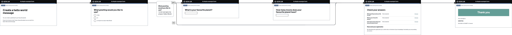

# fb-example-service

A simple example form for Form Builder

[](assets/form-flow.png)


## Usage

The easiest way to get this form up and running is to use the [`Form Builder Editor Console`](https://github.com/ministryofjustice/fb-editor-console-electron).

It can be downloaded [here](https://github.com/ministryofjustice/fb-editor-console-electron/releases)

- Open the app and wait for installation to complete
- Click `Add existing form`
- Enter the address of this repository (`https://github.com/ministryofjustice/fb-example-service.git`) in the `Repository address` field
- Click `Add form`
- Click `Start` link

The form will open in a new window in your default browser.

### Alternative ways

You can also run the form  using the Form Builder Editor or Runner

- [Editor](https://github.com/ministryofjustice/fb-editor-node)
- [Runner installation instructions](https://github.com/ministryofjustice/fb-runner-node)

```
git clone https://github.com/ministryofjustice/fb-example-service.git

cd /path/to/editor-or-runner

SERVICE_PATH=/path/to/fb-example-service npm start
```
